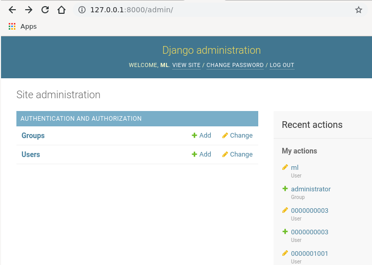
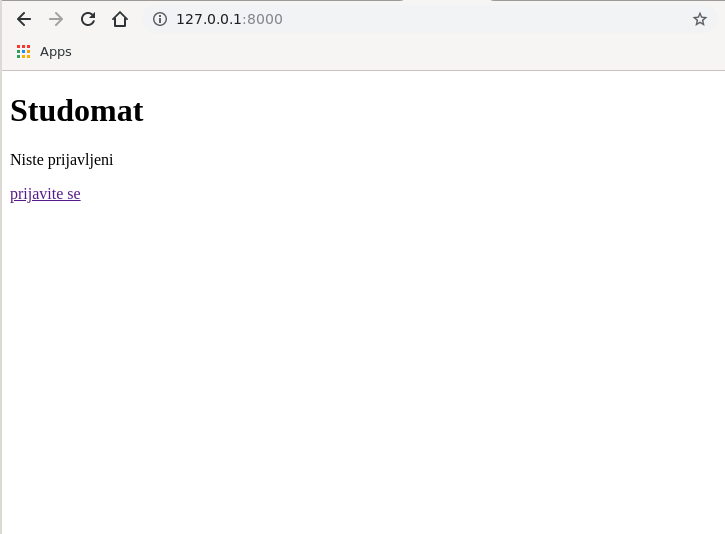
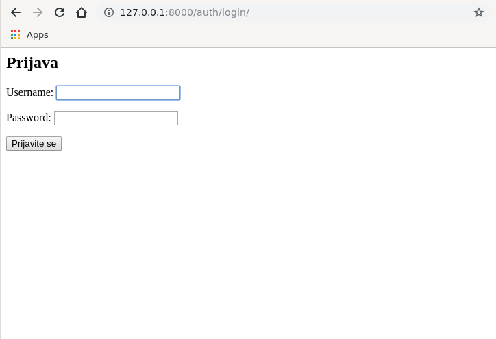
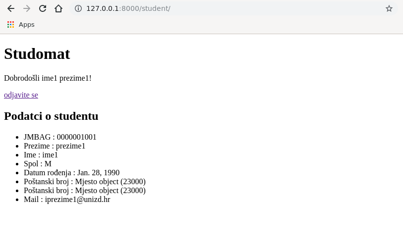
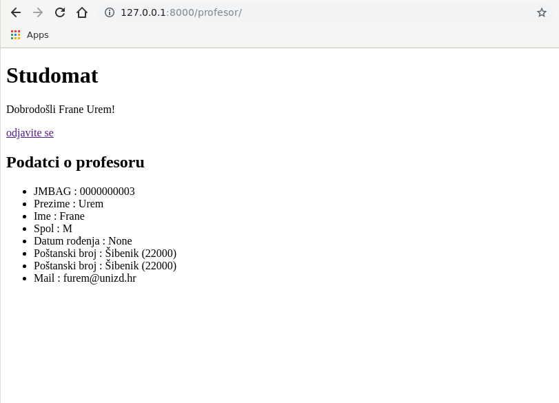
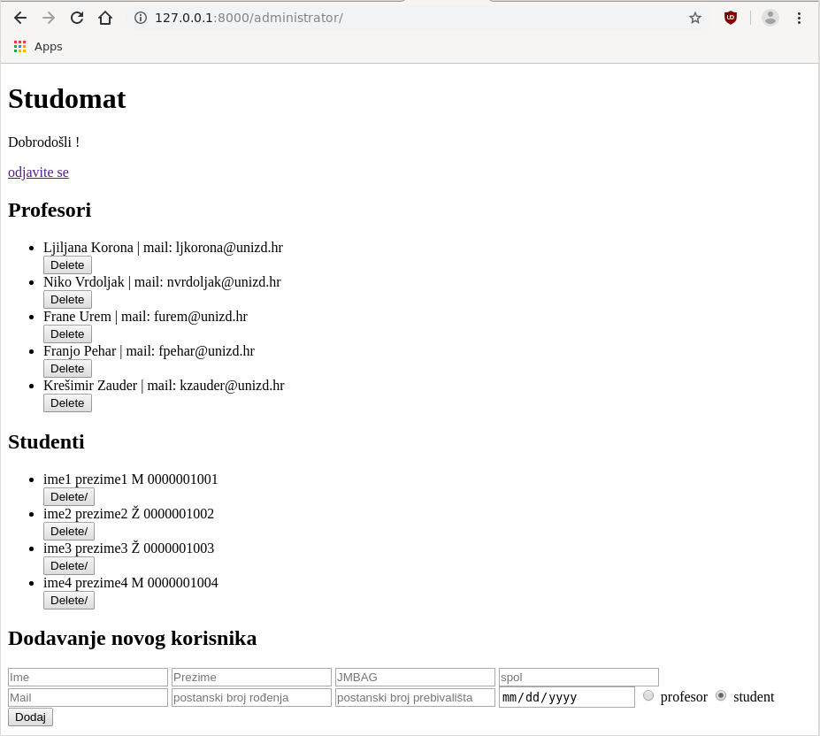
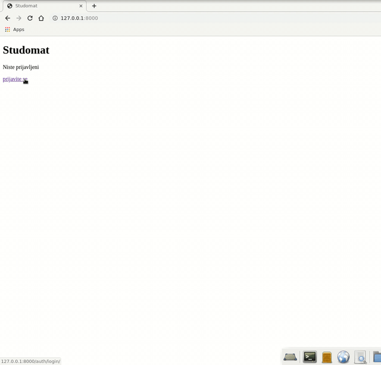

# web_app_zavrsni_projekt

Web aplikacija studomat clone je razvijena koristeći django framework i postgresql bazom podataka. 
Baza podataka i njene tablice su kreirane i punjene unutar psql konzole, a django Modeli su kreirani kroz naredbu
```bash
$ ppython3.7 manage.py initdb
```
Aplikacija studomat je zamišljena tako da postoje tri grupe korisnika:
* student
* profesor
* administrator

Grupa studenata i profesora se ne mogu registrirati online putem koristeći aplikaciju već je aplikacija osmišljena
tako da administrator dodjeli korisnička imena i lozinke, te ih dostavi studentima i profesorima.

Da bi ste izradili račune za studente i profesore potrebno se ulogirati u aplikaciju na [linku](http://127.0.0.1:8000/admin/)
sa podacima :
* Username: ml
* Password: 1475



Kako bi testirali aplikaciju nije potrebno izrađivati nove račune već će računi biti napisani na kraju README.md datoteke, 
no u slučaju izrade novih računa potrebno je naglasiti da se **obavezno izabere grupa** u kojoj se nalazi novi korisnik.
Username studenta i profesora **mora biti JMBAG**.


### Korištenje aplikacije s prethodno izrađenim korisničkim računima





Klikom na [linku](http://127.0.0.1:8000/) otvara se početna stranica aplikacije, u koju je potrebno unijeti prethodno izrađeni
korisnički račun. Nakon uspiješne autorizacije provesti če se autentifikacijski proces koji če nas usmjeriti na dio aplikacije
namjenjen za vrstu korisničkog računa, tj. ukoliko smo ulogirali korisnika:
* studenta, aplikacija če nas preusmjeriti na /student path

* profesora, aplikacija će nas preusmjeriti na /profesor path

* administratora, aplikacija će nas preusmjeriti na /administrator path


Student u ovoj verziji studomata ima prava samo gledati svoje osobne podatke, istu stvar i profesor.
Administrator može upravljati osobnim podacima studenta i profesora.

Student i profesor ne može uređivati ni mijenjati svoje osobne podatke, to obavlja administrator prije dodjele korisničkog imena tako da ukoliko se ulogirate u student ili profesor račun čiji osobni podaci nisu unijeti od strane administratora, polja osobnih podataka će biti prazna. 

#### Animacija upotrebe

